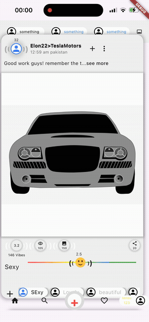

<div align="center">

# 🎚️ Animated Custom Slider

**A hand-built, physics-aware rating slider for Flutter — drag, double-tap, or long-press to rate, with a reactive wave line, spring-loaded emoji, and audio feedback.**

[](https://flutter.dev)
[](https://dart.dev)
[](#)
[](./LICENSE)

</div>

<div align="center">
  
</div>

<br/>

## Overview

This project is a fully custom rating slider built from scratch in Flutter — no third-party slider package involved. Every interaction (drag, double-tap, long-press) drives a hand-tuned animation system: a `CustomPainter`-drawn wave line that bends toward the touch point, a bouncing emoji indicator with tagged multi-track animations, and a rating readout with its own font-size and opacity choreography.

It started as a UI experiment and turned into a small animation engine — `TaggedSequenceAnimation`, a drop-in replacement for the now-unmaintained `flutter_sequence_animation` package, drives dozens of independently-timed tracks (radius, angle, opacity, position, font size) off a single `AnimationController` and `TweenSequence`.

## ✨ Features

- **Multi-gesture rating input** — drag horizontally, double-tap anywhere, or long-press to set a rating
- **Reactive wave line** — a `CustomPainter` line bends into a smooth Bézier/cubic curve toward the active touch position, with a linear gradient stroke
- **Spring-back emoji indicator** — bounces and rotates into position using a tagged, multi-track tween sequence (radius, angle, opacity)
- **Live numeric readout** — rating value animates in size and opacity as it settles
- **Haptic-style audio feedback** — different sound cues play depending on the rating band (via `audioplayers`)
- **Custom animation engine** — `TaggedSequenceAnimation` lets any number of named tracks share one `AnimationController`, each with its own begin/end/curve/time window
- **No slider package used** — every pixel of motion is hand-tuned

## 🎬 Demo

<div align="center">
  
</div>

## 🧱 Tech Stack

| Layer | Choice |
|---|---|
| Framework | Flutter (Dart 3) |
| Rendering | `CustomPainter` + `Canvas` for the wave line |
| Animation | `AnimationController`, `TweenSequence`, custom `TaggedSequenceAnimation` |
| Audio | [`audioplayers`](https://pub.dev/packages/audioplayers) |
| Gestures | Raw `GestureDetector` (drag, double-tap, long-press) — no external gesture package |

## 🚀 Getting Started

### Prerequisites

- [Flutter SDK](https://docs.flutter.dev/get-started/install) 3.x
- Dart 3.x (bundled with Flutter)
- Xcode (for iOS) and/or Android Studio (for Android)

### Installation

```bash
git clone https://github.com/Tensae-abita/animated-custom-slider.git
cd animated-custom-slider
flutter pub get
```

### Run

```bash
# iOS simulator or connected device
flutter run

# Android emulator or connected device
flutter run -d android
```

> On first run, if you've just cloned, make sure CocoaPods is installed for iOS (`cd ios && pod install`) and that your Flutter SDK constraint in `pubspec.yaml` matches your installed `flutter --version`.

## 📁 Project Structure

```
lib/
├── main.dart                     # App entry point
├── home_page.dart                # Scaffold hosting the slider
├── slider_widget.dart            # Core slider: gestures, wave painter, positioning logic
├── tagged_sequence_animation.dart# Custom multi-track TweenSequence animation engine
├── app_bar.dart                  # Top navigation bar
├── body.dart                     # Content card surrounding the slider
└── bottom_nav.dart                # Bottom navigation bar

assets/
├── images/                       # Emoji, illustration assets
└── sounds/                       # Rating feedback audio cues
```

## 🎛️ How the Animation Engine Works

`TaggedSequenceAnimation` (in `tagged_sequence_animation.dart`) is a lightweight replacement for the abandoned `flutter_sequence_animation` package. You describe a flat list of `SequenceItem`s — each with a `tag`, `begin`/`end` value, a time window (`from`/`to`), and an optional curve — and it:

1. Groups items by tag
2. Fills any time gaps with a `ConstantTween` so the value holds steady
3. Chains each active segment with a `CurveTween`
4. Builds one `TweenSequence` per tag, all driven by the same shared `AnimationController`

```dart
sequenceAnimation = buildSequenceAnimation(
  controller: _controller,
  totalDuration: const Duration(milliseconds: 2200),
  items: [
    SequenceItem(tag: 'radius', begin: 17.0, end: 40.0,
        from: Duration.zero, to: const Duration(milliseconds: 500)),
    SequenceItem(tag: 'radius', begin: 40.0, end: 17.0,
        from: const Duration(milliseconds: 500), to: const Duration(milliseconds: 1000)),
    // ...more tracks: angle, opacity, font_size, etc.
  ],
);

// Later, in build():
sequenceAnimation['radius'].value
```

This made it possible to choreograph the emoji bounce, wave curvature, and text fade entirely independently while keeping them perfectly in sync on one timeline.

## 🗺️ Roadmap

- [ ] Extract the slider into a standalone, publishable pub.dev package
- [ ] Expose configuration (colors, sounds, emoji set) via constructor parameters
- [ ] Add unit/widget tests around `TaggedSequenceAnimation`
- [ ] Web and desktop gesture support

## 🤝 Contributing

Issues and pull requests are welcome. If you're proposing a larger change, please open an issue first to discuss what you'd like to change.

## 📄 License

This project is licensed under the MIT License — see the [LICENSE](./LICENSE) file for details.

---

<div align="center">
Built with Flutter, way too many `Positioned` widgets, and a lot of trial and error on the math.
</div>
